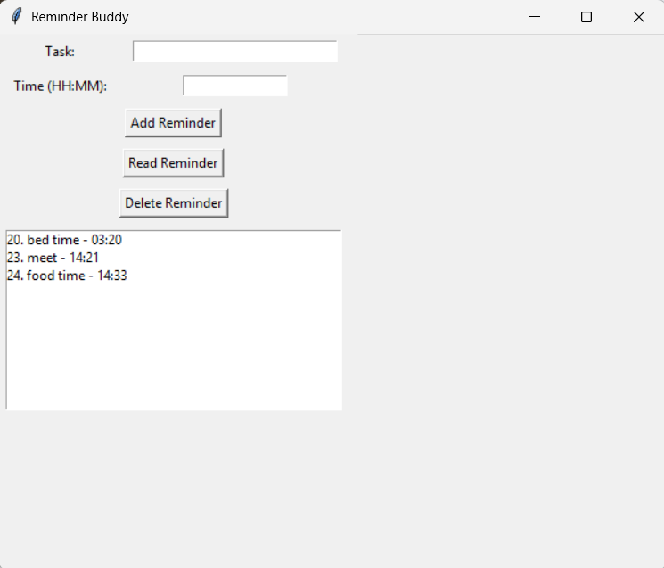
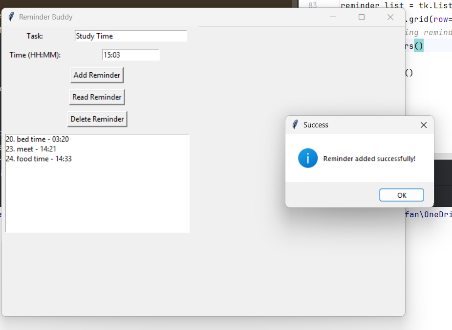
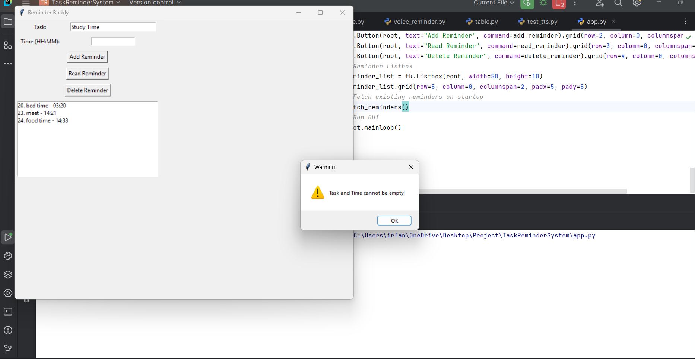
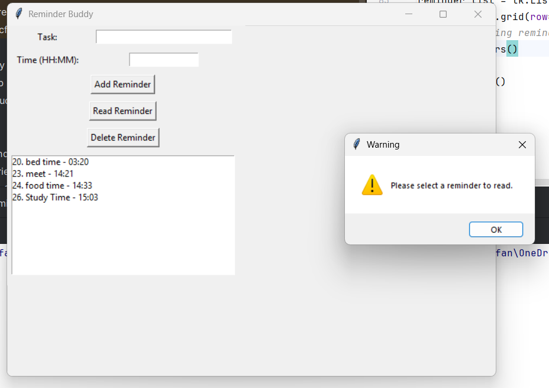
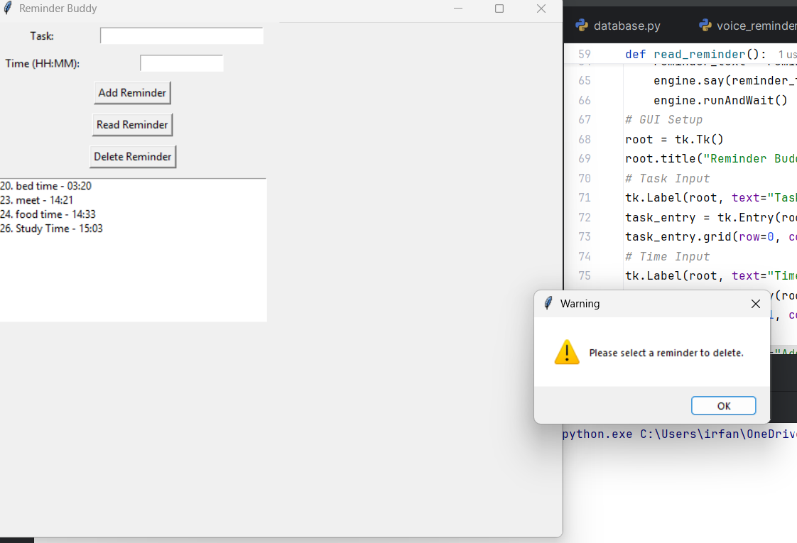
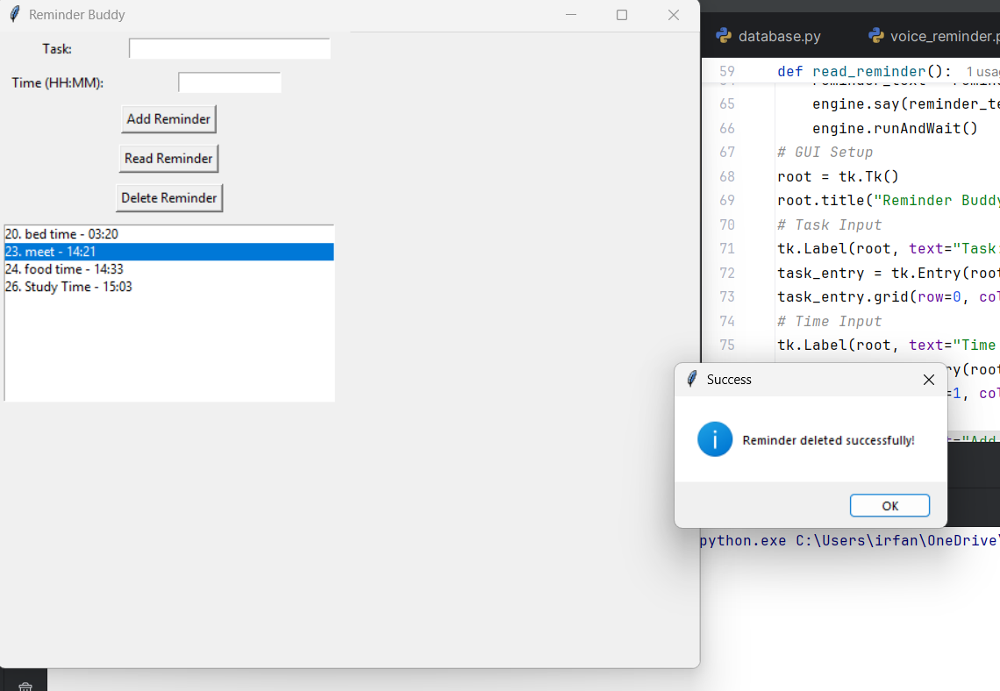
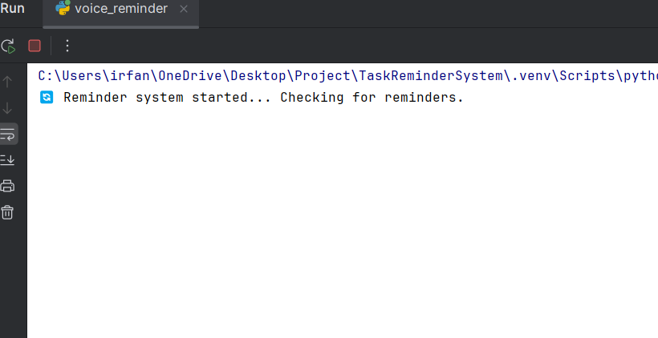
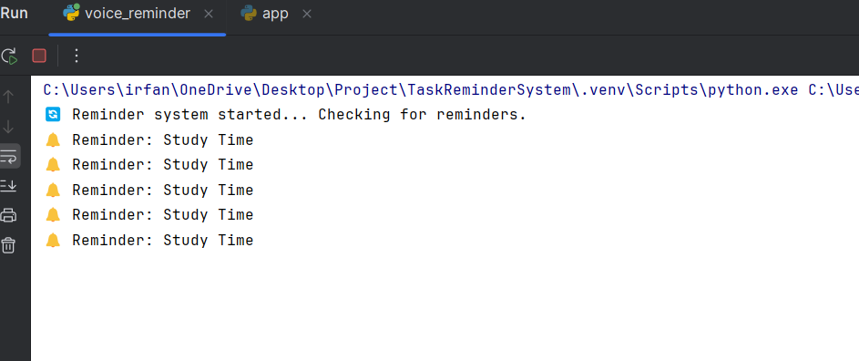

# Reminder Buddy – Voice Based Task Reminder System

## Overview

Reminder Buddy is a Python-based desktop reminder application developed using Tkinter and SQLite.  
The system helps users manage daily tasks by setting reminders with specific times.

When the scheduled reminder time arrives, the application automatically displays the reminder message and announces the task using voice notification through pyttsx3.

The project also supports continuous reminder checking with customizable repeat intervals.

---

## Features

- Add task reminders with custom time
- Read saved reminders from database
- Delete reminders
- Voice-based reminder announcement using pyttsx3
- Automatic popup and voice notification when reminder time arrives
- Continuous background reminder checking
- Configurable reminder repeat interval using `time.sleep()`
- Input validation for empty fields and invalid operations
- Simple and user-friendly GUI using Tkinter

---

## Technologies Used

- Python
- Tkinter
- SQLite
- pyttsx3

---

## Project Structure

```text
app.py                -> Main GUI application
database.py           -> Database operations
voice_reminder.py     -> Voice reminder functionality
table.py              -> Database table creation
reminder.db           -> SQLite database
requirements.txt      -> Required Python package
```

---

## Screenshots

### Home Interface
Shows the main reminder dashboard.



---

### Adding Reminder
Adding a new task reminder successfully.



---

### Reminder Validation
Displays warning when task or time field is empty.



---

### Read Reminder Validation
Displays warning when no reminder is selected.



---

### Delete Reminder Validation
Displays warning when no reminder is selected for deletion.



---

### Reminder Deleted
Shows successful reminder deletion.



---

### Voice Reminder Running
Continuous reminder checking with voice notification.



---

### Reminder Notification
Reminder displayed and announced when scheduled time arrives.



---

## How to Run

1. Clone or download the repository

2. Install required package

```bash
pip install pyttsx3
```

3. Run the application

```bash
python app.py
```

4. Run voice reminder system

```bash
python voice_reminder.py
```

---

## Future Improvements

- Dark mode support
- Snooze reminder option
- Notification sound customization
- Reminder completion status
- Improved GUI design

---

## Author

Irfana Sherin
